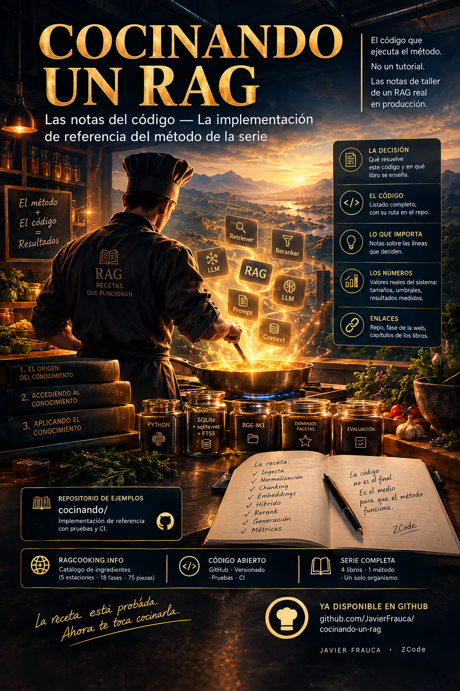

# Cocinando un RAG — las notas del código



Cuarto volumen de la serie ([*El Origen del Conocimiento*](https://javierfrauca.github.io/el-origen-del-conocimiento/) · [*Accediendo al Conocimiento*](https://javierfrauca.github.io/accediendo-al-conocimiento/) · [*Aplicando el Conocimiento*](https://javierfrauca.github.io/aplicando-al-conocimiento/) · este).

Los tres primeros libros enseñan el método **sin código** — qué decidir, en qué orden, con qué evidencia y con qué criterio de salida. Este libro es otro género a propósito: **las notas del código**. No es un tutorial paso a paso ni un manual de framework: es el comentario anotado de una **implementación de referencia** que ejecuta el método completo — del documento a la píldora, de la píldora al índice, del índice a la respuesta — sobre el sistema real de la serie: el RAG de un despacho laboral en producción.

**Libro y código viven juntos**: los listados de cada capítulo son el paquete [`cocinando/`](cocinando/) de este mismo repositorio, con sus [pruebas](pruebas/) — 26 puertas de salida que la [CI](.github/workflows/ci.yml) ejecuta en cada cambio (`mkdocs build --strict` para el libro, `pytest` para el código, y una prueba de sincronía que verifica que cada listado del libro es el código real del paquete).

## Con qué se cocina

- **Python** — el ecosistema RAG es Python-first (LlamaIndex, LangGraph, Haystack, sentence-transformers, Ragas).
- **SQLite con `sqlite-vec` + FTS5** — el canal denso y el léxico en un archivo, sin servidor ni contenedor. Límites honestos: KNN por fuerza bruta, perfecto hasta decenas de miles de píldoras. La variante de producción (Qdrant) cabe detrás del mismo puerto.
- **BGE-M3 local por omisión** — gratis, multilingüe, sin clave de API; `text-embedding-3-small` como segundo adaptador.
- **Tres capas, SOLID sin ceremonia** — dominio (modelos, puertos `Protocol`, lógica pura), aplicación (un caso de uso por fase), infraestructura (adaptadores intercambiables). El repositorio es el contrato de recuperación hecho interfaz.

El catálogo de ingredientes vive en [ragcooking.info](https://ragcooking.info/) (5 estaciones, 18 fases, 75 piezas); el porqué de cada decisión, en los tres libros; el cómo, aquí.

## Ejecutar los ejemplos

**Arranque en un minuto** — siembra la base con el corpus de ejemplo, sin modelos ni claves:

```bash
python sembrar.py --consultar "plazo de reclamación" --vara
```

```
cocer: 11/11 (ruido 0.0%)
ventana: 11/11 (ruido 0.0%)
indexado: 11/11 (ruido 0.0%)
Base sembrada en cocinando.db: 11 píldoras de 3 fuentes declaradas en el manifiesto.

Vara sobre el dataset de ejemplo: recall@10 = 0.67 · MRR = 0.20 sobre 3 consultas firmadas.

«plazo de reclamación»
  0.0306 [denso+lexico] Sentencia 88/2023 … > Fallo
  0.0305 [denso+lexico] Sentencia 88/2023 … > Fundamentos de derecho
  ...
```

La siembra es idempotente (dos veces = el mismo índice). Con `--embeddings local` lo mismo con BGE-M3 de verdad; el corpus de ejemplo vive en [`datos/`](datos/) — sustitúyelo por el tuyo editando `datos/corpus/` y `datos/manifiesto.json`. **Los datos y las métricas del demo son de demostración**: existen para ver el sistema funcionar de punta a punta — el corpus de verdad es el tuyo, y sus números los firma tu vara.

**La suite completa** — corre sin red ni claves:

```bash
pip install pytest sqlite-vec
pytest -q                              # 26 pruebas en verde

pip install -r requirements-examples.txt   # lo completo: BGE-M3 y la variante de API
```

## Construir el sitio

```bash
pip install -r requirements.txt
mkdocs serve
```

## Licencia

Texto: CC BY-NC-SA 4.0 — Javier Frauca & ZCode ([LICENSE.md](LICENSE.md)). Código de los ejemplos: MIT ([LICENSE-CODE.md](LICENSE-CODE.md)).
