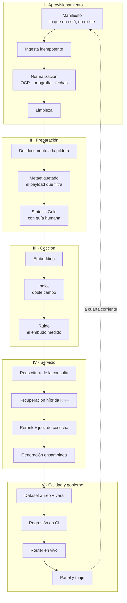

# 2 · La receta entera: el mapa del despacho

Antes de abrir pieza alguna, el mapa completo — para saber siempre en qué fase del método está el código que se está leyendo. La receta que este libro cocina es la del único sistema que la serie reconoce como literal: el RAG del despacho laboral. Todo lo demás — soporte técnico, clínico, asegurador — son variaciones de la misma cocina sobre otros ingredientes, y así se tratará: **una receta canónica, cocinada de principio a fin, y las variantes donde las diferencias importan.**

## El pipeline entero

Las 5 estaciones y las 18 fases de [ragcooking.info](https://ragcooking.info/), ejecutadas. Nada de este diagrama es nuevo para quien leyó los tres libros; lo nuevo es que cada caja de aquí abajo tiene un capítulo con su código.



La flecha discontinua es el sistema circulatorio de la serie: lo que las respuestas enseñan vuelve al aprovisionamiento. Sin ella, la receta es un pipeline; con ella, es un organismo.

## Con qué se cocina

Las decisiones de taller de esta implementación de referencia, dichas claras — porque cada una sirve al método y ninguna al presigillo:

- **Python.** El ecosistema RAG es Python-first: LlamaIndex, LangGraph y Haystack — tres de los conjuntos de la web —, sentence-transformers, Ragas y el cliente de Qdrant nacen ahí. El listado más corto posible para cada concepto, y lo que el lector aprenda aquí lo reutiliza en cualquier tutorial del mundo.
- **SQLite como base de datos: `sqlite-vec` + FTS5, todo en un archivo.** El canal denso (la extensión `sqlite-vec`, `pip install sqlite-vec`, sin servidor ni contenedor) y el canal léxico (FTS5, el BM25 que SQLite trae de serie) viven en el mismo fichero — el capítulo del híbrido con RRF sale sin infraestructura alguna. Sus límites, dichos: KNN por fuerza bruta (perfecto hasta decenas de miles de píldoras; no para millones) y escritura en solitario. Por eso el repositorio es un **puerto con dos implementaciones**: SQLite por omisión para leer y probar, Qdrant — el motor del sistema real, desvelado en el apéndice del libro 2 — como variante de producción. Cambiar de motor con regresión obligada es, literalmente, el capítulo 19 del libro 2 ejecutándose.
- **Embeddings locales por omisión, API como variante.** BGE-M3 con sentence-transformers: gratis, multilingüe, corre en el portátil sin clave de API — el lector cocina offline y el corpus nunca sale de su máquina (la cultura de privacidad de la serie es también práctica). La variante propietaria (text-embedding-3-small) entra en el cap. 8 como el segundo adaptador del mismo puerto: misma interfaz, mismo índice, regresión al cambiar.
- **Arquitectura en tres capas, SOLID sin ceremonia.** *Dominio* (modelos, puertos y la lógica pura del método — el chunking no sabe qué embedding lo cocerá), *aplicación* (los casos de uso: una fase del método cada uno, inyección por constructor) e *infraestructura* (sqlite-vec, embeddings, LLM — los adaptadores intercambiables). El patrón repository no es adorno: **el repositorio es el contrato de recuperación de la serie hecho interfaz**. Y la regla de la casa es la del libro 1: mínimo viable, acotado — la arquitectura sirve al método; donde la sobra, se poda.

## El repositorio, pieza a pieza

El código de los ejemplos se organiza en tres capas — y dentro de ellas, en el orden que el método manda:

```text
cocinando/
  dominio/                  ← lo que no envejece: el método sin I/O
    modelos.py              todos los dataclasses: Píldora, Hit, Veredicto, Respuesta
    puertos.py              los contratos (Protocol): el sumario de contratos del libro 2
    pildoras.py             cap. 5   del documento a la píldora (lógica pura)
  aplicacion/               ← los casos de uso: una fase del método cada uno
    aprovisionamiento.py    caps. 3-4   manifiesto, ingesta, normalización, limpieza
    sintesis.py             cap. 7      el Gold con guía humana
    cocer.py                caps. 8-10  incrustar, indexar, medir el embudo
    servir.py               caps. 11-14 reescribir, híbrido, juez, generar
    evaluar.py              caps. 15-16 la vara y la regresión
    encaminar.py            cap. 17     el router y la matriz en vivo
    triaje.py               cap. 18     el panel y la cuarta corriente
  infraestructura/          ← los adaptadores intercambiables
    sqlite_repo.py          caps. 9, 11 FTS5 + sqlite-vec: dos canales, un archivo
    embeddings_local.py     cap. 8      BGE-M3 (por omisión)
    embeddings_api.py       cap. 8      text-embedding-3-small (variante)
    llm.py                  caps. 13-14 el juez de cosecha y la generación
    configuracion.py        modelos y motores en un solo sitio: cambio con regresión
pruebas/                    ← la puerta de salida de cada capítulo
```

Dos convenciones del repo que conviene fijar ahora. **Primera**: cada pieza es importable y probable por separado — ningún capítulo depende de haber ejecutado el anterior, porque cada puerta de salida tiene su prueba. **Segunda**: las dependencias de modelos y motores viven en `configuracion.py`, para que el cambio de embedding o de motor sea un despliegue con regresión — como manda el libro 2 — y no una caza de cadenas de texto.

## Lo que importa

1. **El orden del repo es el orden del método.** No es estética: es la garantía de que cada decisión se toma donde los libros la sitúan. El chunking no sabe qué embedding lo cocerá; el índice no elige el tope; la generación no decide el patrón. Cada fase recibe de la anterior exactamente lo que el contrato de la serie le promete — y nada más.
2. **La única flecha hacia atrás es el triaje.** El pipeline corre en una dirección; solo la cuarta corriente del libro 3 vuelve al principio. Si una pieza "necesita" saber de una fase posterior, la arquitectura está gritando que algo está mal puesto.
3. **La receta canónica es un despacho, no un demo.** Los ejemplos corren sobre documentos laborales reales — convenios, sentencias, circulares — porque es el único terreno donde los números de este libro son literales. Las variantes sectoriales se cuentan cuando cambia la cocina, no el ingrediente.

## Enlaces

- Fases de la web: [las 5 estaciones](https://ragcooking.info/biblioteca)
- Libro 1: la cadena de suministro del corpus · Libro 2: el contrato de recuperación · Libro 3: el espectro y la respuesta
- Siguiente pieza: cap. 3 · El manifiesto y la ingesta
